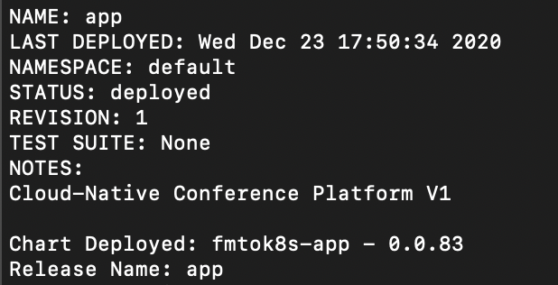
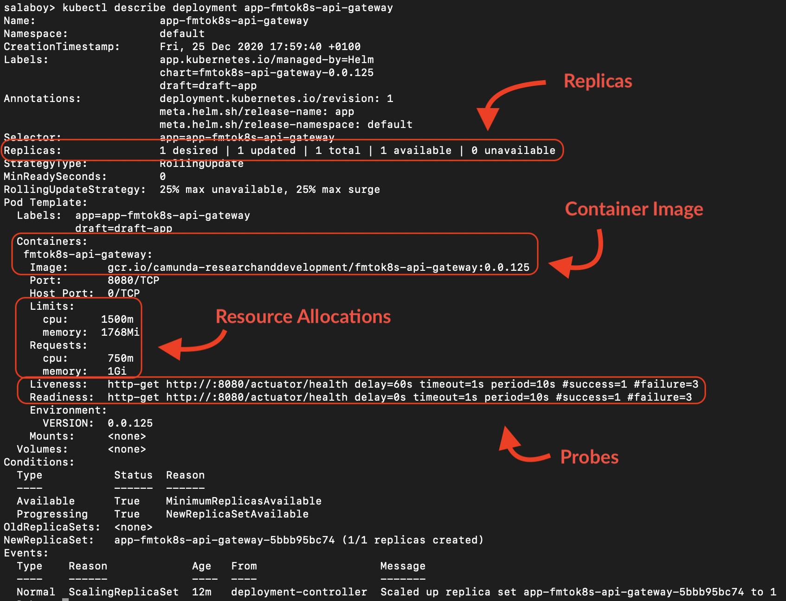
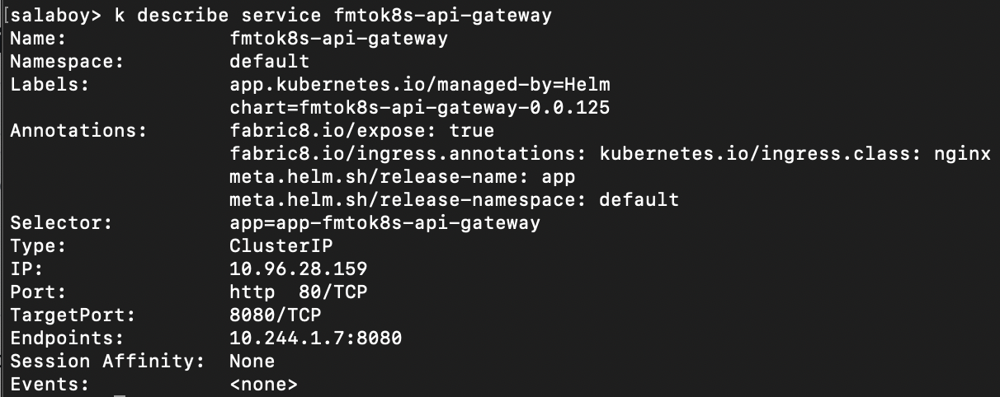

# Running the application with Kubernetes KIND

## Pre-Requisites
- `kubectl` installed. [For instructions check here](https://kubernetes.io/docs/tasks/tools/install-kubectl/)
- Helm 3 installed. [For instructions check here](https://helm.sh/docs/intro/install/)

## Creating a Kubernetes Cluster with KIND

Install [Kubernetes KIND](https://kind.sigs.k8s.io/docs/user/quick-start/#installation), this will allow you to create a new Kubernetes Cluster running on your laptop. 

```
cat <<EOF | kind create cluster --name dev --config=-
kind: Cluster
apiVersion: kind.x-k8s.io/v1alpha4
nodes:
- role: control-plane
  kubeadmConfigPatches:
  - |
    kind: InitConfiguration
    nodeRegistration:
      kubeletExtraArgs:
        node-labels: "ingress-ready=true"
  extraPortMappings:
  - containerPort: 80
    hostPort: 80
    protocol: TCP
  - containerPort: 443
    hostPort: 443
    protocol: TCP
- role: worker
- role: worker
- role: worker
EOF
```

The cluster that you are creating will have 4 nodes, 3 workers and a control plane. 
This is to simulate a real cluster with a set of machines or virtual machines. 
Notice that you are also setting up an ingress controller and some port-mappings in order to be able to route traffic from your laptop to the cluster.


In order to connect your `kubectl` CLI tool with this newly created you might need to run:

```
kubectl cluster-info --context kind-dev
```


Once you connected with the cluster you can start running commands against the cluster. For example you can check the cluster nodes by running:

```
kubectl get nodes -owide
```


As you can see,  your Kubernetes Cluster is composed by 4 nodes and one of those is the control plane. 

Finally, you will use NGINX Ingress Controller ([more detailed instructions can be found here](https://kind.sigs.k8s.io/docs/user/ingress/), this requires you to install it by running the following command:

```
kubectl apply -f https://raw.githubusercontent.com/kubernetes/ingress-nginx/master/deploy/static/provider/kind/deploy.yaml
```


As a side note, you can check where this Ingress Controller is running in your cluster by running:

```
kubectl get pods -n ingress-nginx -owide
```


As you might guessed, the Ingress Controller was installed in the Control Plane node. 

Congrats your Cluster is up and running and you can connect with `kubectl`! 

## Installing the application

Now you are ready to install the application. 
You are going to install the application using Helm, a package manager for Kubernetes Applications. Helm allows you to install a complex Cloud-Native application and 3rd party software with a single command line. In order to install Helm Charts (packages/applications) you can add new repositories where your applications are stored. For java developers, these repositories are like Maven Central, Nexus or Artifactory. 

```
helm repo add dev http://chartmuseum-jx.35.222.17.41.nip.io
helm repo update
```

The previous two lines added a new repository to your Helm installation called `dev`, the second one fetched a file describing all the available packages and their versions in each repo that you have registered. 

Now that your Helm installation fecthed all the available packages description, let's install the application with the following line:

```
salaboy> helm install app dev/fmtok8s-app     
NAME: app
LAST DEPLOYED: Wed Dec 23 12:00:24 2020
NAMESPACE: default
STATUS: deployed
REVISION: 1
TEST SUITE: None
NOTES:
Cloud-Native Conference Platform V1

Chart Deployed: fmtok8s-app - 0.0.82
Release Name: app

```



This creates a Helm Release, which basically means that the application has one instance. With Helm you can deploy multiple instances of the application if you want to. You can list Helm releases by running:

```
helm list
```


Once the application is deployed, containers will need to be downloaded to your laptop in order to run, this can take a while. You can monitor the progress by listing all the pods running in your cluster, once again, using the `-owide` flag to get more information:

```
kubectl get pods -owide
```


You need to pay attention to the `READY` and `STATUS` columns, where `1/1` in the `READY` column means that one replica of pod is correctly running and one was expected to be running. 

Notice that pods can be scheduled in different nodes in the `NODE` column, this is Kubernetes using the resources available in the cluster in an efficient way.

Finally, because the application contains an Ingress definition ([you can find it here](https://github.com/salaboy/fmtok8s-app/blob/master/charts/fmtok8s-app/templates/ingress.yaml)) you can access the application by pointing your browser to `http://localhost`

You can now go ahead and `Submit a Proposal`, go to the `Back Office` and `Approve` or `Reject` each submitted proposal. Approved proposals will appear in the `Main Page`. 

## Inspecting the application with `kubectl`

Ok, if you have been using Kubernetes for a while you probably know all about `kubectl` and because this version of the application is using native Kubernetes Deployments and Services, you can inspect and troubleshoot these Kubernetes resources using `kubectl`.

Usually, instead of just looking at the Pods that are running, in order to understand and operate the application you will be looking at Services and Deployments.

Let's start with Deployments. Listing Deployments with:

```
kubectl get deployments
```


And you can describe in more detail each deployment with: 

```
kubectl describe deployment app-fmtok8s-api-gateway
```



In this case you are describing the `API Gateway / User Interface Service`

From the `Deployment` details you can get very useful information, such as 
 - **The number of replicas of the service**: for this example is 1, but you will change this in the next section
 - **The container that is being used for this service**: notice that this is just a simple docker container, meaning that you can even run this container locally if you want to with `docker run`
 - **The resources allocation for the container**: depending on the load and the technology stack that you used to build your service, you will need to fine tune how many resources Kubernetes allow your container to use. 
 - **The status of the readyness and liveness probes**: Kubernetes by default will monitor the health of your container. It does that by executing two probes 1) readyness to understand if the container is ready to answer requests 2) liveness if the main process of the container is running
 
If for some reason the deployment is not working, as for example, the number of replicas required is not met, describing the resource will give you insights of where the problem might be. In contrast with `Pods`, `Deployments` are not ephimeral, hence if you create a `Deployment` it it will be there for you to query. By default, Kubernetes create an intermediate object for handling the `Deployment` replicas. This object is called `ReplicaSet` and it can be queried by running:

```
kubectl get replicaset
```


These `ReplicaSet` objects are fully managed by the `Deployment` resource and usually you shouldn't need to deal with them. `ReplicaSet`s are important when dealing with [**Rolling Upgrades**, you can find more information about this topic here](https://kubernetes.io/docs/tutorials/kubernetes-basics/update/update-intro/)

`Deployment`s per se doesn't expose your containers to other container or outside the cluster, for exposing your containers, meaning to enable clients to connect to them, you need to use a Kubernetes `Service` resource. Each application service, defines this `Service` resource, so other services and clients can connect to them. In Kubernetes, `Service`s will be in charge of routing traffic to your application containers. These `Service`s represent a logical name that you can use to abstract where your containers are running. If you have multiple replicas of your containers, the `Service` resource will be in charge of load balance the traffic among all the replicas. 

You can list all the services by running:

```
kubectl get services
```


And you can also describe a `Service` with:

```
kubectl describe service fmtok8s-api-gateway
```


