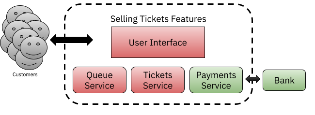
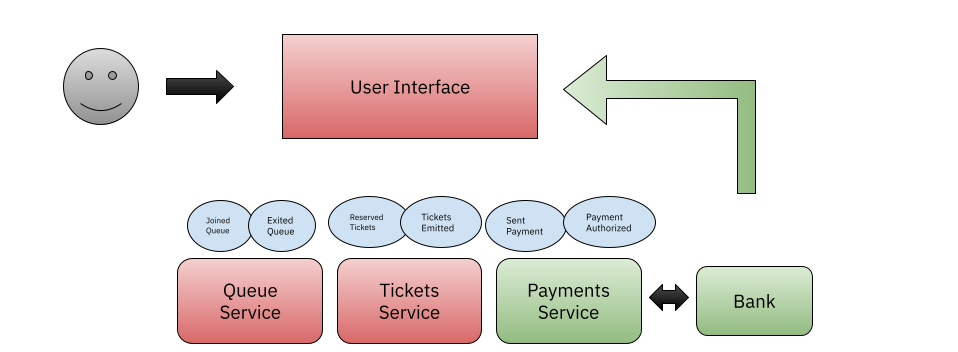

# Knative Eventing Tickets Sale Example


This tutorial install the Conference Platform application using Helm, but it also adds the services to implement the Tickets Selling flow. While the flow of events is not really representative of how an Event-Driven application should be architected, it serves as an example of multiple producers and consumers of events using the CloudEvents SDK to react to other Services events. 

The implemented flow is shown in the following figure: 


This extension of the Conference Platform adds a new set of services which emit and consume events to implement the flow: 



- Queue Service: Serves as a queing mechanism to deal with demand, customers joins the queue and they are served in a first-come/first-served fashion. 
- Tickets Service: handle the available tickest for the event, it locks the tickets until the payment is completed. 
- Payments Service: Interface with a legacy bank system that is not event-driven and waits for payments to be authorized by the external service by polling and exposing the state using events.

The following diagram shows the events that are emitted by each service:



This tutorial covers different implementations of Knative Eventing Brokers such as: 
- In Memory MultiTenant Broker (default)
- [RabbitMQ broker](#replacing-in-memory-broker-for-rabbitmq-broker) 
- [Kafka Broker](#replacing-in-memory-broker-for-kafka-broker)

## Pre Requisites
- Install [Knative Serving](https://knative.dev/docs/install/serving/install-serving-with-yaml/) and [Knative Eventing](https://knative.dev/docs/install/eventing/install-eventing-with-yaml/). 
  - For Knative Serving make sure that you configure the DNS so you get URLs for your Knative Services. 
  - For Knative Eventing install the In-Memory Channel and the MT-Channel based Broker. 
- Patch ConfigMap to support downstream API
- Install the Conference Platform App using Helm and setting the `knativeDeploy` variable to `true`
- Create a Knative Eventing Broker, install SockEye and create a trigger to see all the events

### Creating a Knative Eventing Broker

```
kubectl create -f - <<EOF
apiVersion: eventing.knative.dev/v1
kind: Broker
metadata:
 name: default
 namespace: default
EOF
```
### Patch to support Downstream API
```
kubectl patch cm config-features -n knative-serving -p '{"data":{"tag-header-based-routing":"Enabled", "kubernetes.podspec-fieldref": "Enabled"}}'
```
### Installing the base Conference Platform using Knative Resources

This is installing the base services, enabling Knative Deployment with Knative Services and also enabling events to be emitted by the services to the newly created broker. You will need to fine-tune this configuration if you are using a different broker implementation.
This is also setting some feature flags in the API Gateway Service to enable the tickets menu option and the Call for Proposals (C4P) feature. 

```
cat <<EOF | helm install conference fmtok8s/fmtok8s-app --values=-
fmtok8s-api-gateway:
  knativeDeploy: true
  env:
    KNATIVE_ENABLED: "true"
    AGENDA_SERVICE: http://fmtok8s-agenda.default.svc.cluster.local
    C4P_SERVICE: http://fmtok8s-c4p.default.svc.cluster.local
    EMAIL_SERVICE: http://fmtok8s-email.default.svc.cluster.local
    EVENTS_ENABLED: "true"
    K_SINK: http://broker-ingress.knative-eventing.svc.cluster.local/default/default
    FEATURE_TICKETS_ENABLED: "true"
    FEATURE_C4P_ENABLED: "true"
fmtok8s-agenda-rest:
  knativeDeploy: true
  env:
    EVENTS_ENABLED: "true"
    K_SINK: http://broker-ingress.knative-eventing.svc.cluster.local/default/default
fmtok8s-c4p-rest:
  knativeDeploy: true
  env:
    AGENDA_SERVICE: http://fmtok8s-agenda.default.svc.cluster.local
    EMAIL_SERVICE: http://fmtok8s-email.default.svc.cluster.local
    EVENTS_ENABLED: "true"
    K_SINK: http://broker-ingress.knative-eventing.svc.cluster.local/default/default  
fmtok8s-email-rest:
  knativeDeploy: true
  env:
    EVENTS_ENABLED: "true"
    K_SINK: http://broker-ingress.knative-eventing.svc.cluster.local/default/default
EOF
```

At this point, if you have installed Knative Serving and Eventing, the applicaiton should be up and running. 
You can run the following command to list your Knative Services, they should include the URLs for each service:

```
kubectl get ksvc
```
It should return something like this: 
```
salaboy> kubectl get ksvc
NAME                  URL                                                         LATESTCREATED               LATESTREADY                 READY   REASON
fmtok8s-agenda        http://fmtok8s-agenda.default.X.X.X.X.sslip.io        fmtok8s-agenda-00001        fmtok8s-agenda-00001        True    
fmtok8s-api-gateway   http://fmtok8s-api-gateway.default.X.X.X.X.sslip.io   fmtok8s-api-gateway-00001   fmtok8s-api-gateway-00001   True    
fmtok8s-c4p           http://fmtok8s-c4p.default.X.X.X.X.sslip.io           fmtok8s-c4p-00001           fmtok8s-c4p-00001           True    
fmtok8s-email         http://fmtok8s-email.default.X.X.X.X.sslip.io         fmtok8s-email-00001         fmtok8s-email-00001         True    
```


Now you can use the API-Gateway Knative Service URL to access the Conference Application: http://fmtok8s-api-gateway.default.X.X.X.X.sslip.io (X.X.X.X should be your loadbalancer IP). 


### Installing Sockeye for monitoring events

Sockeye will let you monitor the CloudEvents that are being sent by every service of the application

```
kubectl apply -f https://github.com/n3wscott/sockeye/releases/download/v0.7.0/release.yaml
```

Once again, you can list your Knative Services to find Sockeye URL:

```
kubectl get ksvc
```
It should now include Sockeye Knative Service: 
```
sockeye               http://sockeye.default.X.X.X.X.sslip.io               sockeye-00001               sockeye-00001               True
```


### Creating a trigger to see all the events going to the broker

You need to let the Knative Eventing Broker to know that should send all the events in the Broker to Sockeye, you do this by creating a new Knative Eventing Trigger:

```
kubectl create -f - <<EOF
apiVersion: eventing.knative.dev/v1
kind: Trigger
metadata:
  name: wildcard-trigger
  namespace: default
spec:
  broker: default
  subscriber:
    uri: http://sockeye.default.svc.cluster.local
EOF
```

## Installing the Tickets Queue Services

To enable the services required to sell tickets inside the Conference application you need to install another Helm Chart

```
cat <<EOF | helm install conference-tickets fmtok8s/fmtok8s-tickets --values=-
fmtok8s-tickets-service:
  knativeDeploy: true
fmtok8s-payments-service:
  knativeDeploy: true
fmtok8s-queue-service:
  knativeDeploy: true
EOF
```

This chart install 3 other Knative Services and register the Knative Triggers to wire services together.

Now the application is ready to be use and you can buy conference tickets from the "Tickets" section. Also, check out the Backoffice Tickets Queue section to simulate other customers queuing for buying tickets. 


## Replacing In-Memory Broker for RabbitMQ Broker

This sections guides you to to change the Broker implementation to use the [https://github.com/knative-sandbox/eventing-rabbitmq/](https://github.com/knative-sandbox/eventing-rabbitmq/).

### Installing RabbitMQ Operators and RabbitMQ Broker
To install RabbitMQ we are going to use the RabbitMQ Cluster Operator. We can install this operator by running:

```
kubectl apply -f https://github.com/rabbitmq/cluster-operator/releases/latest/download/cluster-operator.yml  
```
This operator is hosted inside the `rabbitmq-system` namespace. 


The Operator requires Cert Manager, (TLS enabled admission webhooks require Cert Manager)
```
  kubectl apply -f https://github.com/jetstack/cert-manager/releases/latest/download/cert-manager.yaml
  kubectl wait --for=condition=Ready pods --all -n cert-manager
```

Lastly, install the RabbitMQ Message Topology Operator
```
kubectl apply -f https://github.com/rabbitmq/messaging-topology-operator/releases/latest/download/messaging-topology-operator-with-certmanager.yaml
```
Once we have the Operators and Cert Manager up and running, we can create a RabbitMQ Cluster to be used by the Knative RabbitMQ Broker implementation

First, we create a namespace for the RabbitMQ resources to live in:
```
kubectl create ns rabbitmq-resources
```

Then, lets create a RabbitMQ Cluster for Knative Eventing to use:
```
kubectl create -f - <<EOF
  apiVersion: rabbitmq.com/v1beta1
  kind: RabbitmqCluster
  metadata:
    name: rabbitmq-cluster  
    namespace: rabbitmq-resources
  spec:
    replicas: 1
EOF
```

Now with a RabbitMQ Cluster created, we can install the RabbitMQ Broker implementation:
```
kubectl apply -f https://github.com/knative-sandbox/eventing-rabbitmq/releases/download/knative-v1.0.0/rabbitmq-broker.yaml
```

Now lets create a RabbitMQ Broker instance inside the `rabbitmq-resources` namespace:
```
kubectl create -f - <<EOF
  apiVersion: eventing.knative.dev/v1
  kind: Broker
  metadata:
    name: rabbitmq-broker
    namespace: rabbitmq-resources
    annotations:
      eventing.knative.dev/broker.class: RabbitMQBroker
  spec:
    config:
      apiVersion: rabbitmq.com/v1beta1
      kind: RabbitmqCluster
      name: rabbitmq-cluster
      namespace: rabbitmq-resources
EOF
```

### Updating the application to use the RabbitMQ Broker 

The API-Gateway Knative Service needs to be updated with a new K_SINK and K_SINK_POST_FIX variables. This is due the URL for the RabbitMQ Broker is different from the In-Memory one. 

```
- name: K_SINK
  value: http://rabbitmq-broker-broker-ingress.rabbitmq-resources.svc.cluster.local
- name: K_SINK_POST_FIX
  value: "/broker, /"
```

For the same reason, we need update all application services dispatching events (`fmtok8s-agenda`, `fmtok8s-c4p `, `fmtok8s-email`, `queue-service`, `tickets-service`) to use the following `K_SINK`: 
```
- name: K_SINK
  value: http://rabbitmq-broker-broker-ingress.rabbitmq-resources.svc.cluster.local
```

Finally, Knative Triggers cannot be patched to use the newly created RabbitMQ Broker, hence new triggers will need to be created, for example, let's create the wildcard trigger for the RabbitMQ Broker:

```
kubectl create -f - <<EOF
apiVersion: eventing.knative.dev/v1
kind: Trigger
metadata:
  name: rmq-wildcard-trigger
  namespace: rabbitmq-resources
spec:
  broker: rabbitmq-broker
  subscriber:
    uri: http://sockeye.default.svc.cluster.local
EOF
```

To avoid manually creating all the triggers you can use the `knative-rabbitmq-triggers.yaml` file provided in this repository:

```
kubectl apply -f https://raw.githubusercontent.com/salaboy/from-monolith-to-k8s/master/knative/knative-rabbitmq-triggers.yaml
```

### Debugging RabbitMQ

To debug RabbitMQ resources, find the pod in the `rabbitmq-resources` namespace called
`rabbitmq-cluster-server-0`, and port forward the port `15672`:
```
kubectl port-forward rabbitmq-cluster-server-0 15672:15672 -n rabbitmq-resources
```

Then find the RabbitMQ cluster default credentials, created when the Cluster yaml
was executed. This are located on the secret cluster-default-user in base64 encoding:
```
kubectl get secrets rabbitmq-cluster-default-user  -n rabbitmq-resources -o json | jq -r '.data["default_user.conf"]' | base64 -d
```

Now go to `http://localhost:15672/` and login with this credentials, here you have the
RabbitMQ Management UI were are the resources of RabbitMQ can be managed and monitored.

### RabbitMQ Cleanup

To clean up this project resources use the next commands:
```
helm delete conference conference-tickets
```

And if you have the Knative Eventing RabbitMQ Broker implementation:
```
kubectl delete ns rabbitmq-resources
```


## Replacing In-Memory Broker for Kafka Broker

To change the Broker implementation, and use the [Kafka Broker](https://github.com/knative-sandbox/eventing-kafka-broker) implementation follow the steps described in this section.

A detailed set of instructions on how to install the Kafka Controller, Kafka Broker and a Kafka Cluster using Strimzi can be found [here](https://knative.dev/docs/eventing/broker/kafka-broker/) and [here](https://strimzi.io/quickstarts/). Here are just the basic steps to get things up and running: 

### Installing Kafka Broker, Controller and Kafka Cluster
First, we create a namespace for the Kafka resources to live in:
```
kubectl create ns kafka
```

Install the Kafka Controller: 
```
kubectl apply --filename https://github.com/knative-sandbox/eventing-kafka-broker/releases/download/knative-v1.1.0/eventing-kafka-controller.yaml
```

Now install the Kafka Broker: 
```
kubectl apply --filename https://github.com/knative-sandbox/eventing-kafka-broker/releases/download/knative-v1.1.0/eventing-kafka-broker.yaml
```

And now let's create a new Kafka Cluster with Strimzi. First install the Strimzi Controller and all the permissions required to create Kafka Clusters:

```
kubectl create -f 'https://strimzi.io/install/latest?namespace=kafka' -n kafka
```
Now, we are ready to create a Kafka Cluster:

```
kubectl apply -f https://strimzi.io/examples/latest/kafka/kafka-persistent-single.yaml -n kafka 
```

Because we have just created a Kafka Cluster with a single node, we need to configure it on the Kafka Broker configuration, for that you need to edit the ConfigMap called `kafka-broker-config` inside the `knative-eventing` namespace: 

```
apiVersion: v1
kind: ConfigMap
metadata:
  name: kafka-broker-config
  namespace: knative-eventing
data:
  # Number of topic partitions
  default.topic.partitions: "10"
  # Replication factor of topic messages.
  default.topic.replication.factor: "1"
  # A comma separated list of bootstrap servers. (It can be in or out the k8s cluster)
  bootstrap.servers: "my-cluster-kafka-bootstrap.kafka:9092"
```
Make sure that the `default.topic.replication.factor: "1"` is set to 1

Finally, lets create a Kafka Broker instance to connect with our recently created Kafka Cluster (we are also setting a dead letter sink to `sockeye`):
```
kubectl create -f - <<EOF
apiVersion: eventing.knative.dev/v1
kind: Broker
metadata:
  annotations:
    # case-sensitive
    eventing.knative.dev/broker.class: Kafka
  name: kafka-broker
  namespace: default
spec:
  # Configuration specific to this broker.
  config:
    apiVersion: v1
    kind: ConfigMap
    name: kafka-broker-config
    namespace: knative-eventing
  # Optional dead letter sink, you can specify either:
  #  - deadLetterSink.ref, which is a reference to a Callable
  #  - deadLetterSink.uri, which is an absolute URI to a Callable (It can potentially be out of the Kubernetes cluster)
  delivery:
    deadLetterSink:
      ref:
        apiVersion: serving.knative.dev/v1
        kind: Service
        name: sockeye

EOF
```

Check that the broker is up and running and with a valid URL: 

```
kubectl get broker
```
Should show something like this: 
```
salaboy> k get broker
NAME           URL                                                                                   AGE     READY   REASON
default        http://broker-ingress.knative-eventing.svc.cluster.local/default/default              4d17h   True    
kafka-broker   http://kafka-broker-ingress.knative-eventing.svc.cluster.local/default/kafka-broker   6m14s   True    
```

### Updating the application to use the new Kafka Broker

The API-Gateway Knative Service (`fmtok8s-api-gateway`) needs to be updated with a new K_SINK and K_SINK_POST_FIX variables. This is due the URL for the Kafka Broker is different from the In-Memory one. 

```
- name: K_SINK
  value: http://kafka-broker-ingress.knative-eventing.svc.cluster.local
- name: K_SINK_POST_FIX
  value: /broker/, /default/kafka-broker   
```

For the same reason, we need update all application services dispatching events (`fmtok8s-agenda`, `fmtok8s-c4p `, `fmtok8s-email`, `queue-service`, `tickets-service`) to use the following `K_SINK`: 
```
- name: K_SINK
  value: http://kafka-broker-ingress.knative-eventing.svc.cluster.local/default/kafka-broker
```

Finally, Knative Triggers cannot be patched to use the newly created Kafka Broker, hence new triggers will need to be created, for example, let's create the wildcard trigger for the Kafka Broker:

```
kubectl create -f - <<EOF
apiVersion: eventing.knative.dev/v1
kind: Trigger
metadata:
  name: kafka-wildcard-trigger
spec:
  broker: kafka-broker
  subscriber:
    uri: http://sockeye.default.svc.cluster.local
EOF
```

To avoid manually creating all the triggers you can use the `knative-rabbitmq-triggers.yaml` file provided in this repository:

```
kubectl apply -f https://raw.githubusercontent.com/salaboy/from-monolith-to-k8s/master/knative/knative-kafka-triggers.yaml
```

### Kafka Cleanup

To clean up this project resources use the next commands:
```
helm delete conference conference-tickets
```
and
```
kubectl delete ns kafka
```

## Triggers for Default In-Memory Broker
If you changed the broker implementation and you deleted or modified the default triggers that are installed when you install the charts you can re-create them by running the following command: 


```
kubectl apply -f https://raw.githubusercontent.com/salaboy/from-monolith-to-k8s/master/knative/knative-default-triggers.yaml
```
